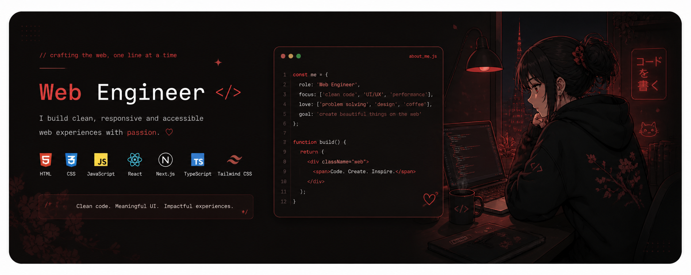
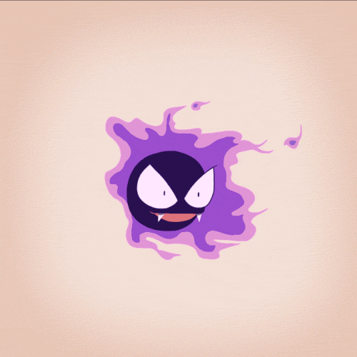

  

<h1>
  
  Heeeeyy! I'm <a href="https://github.com/esspindola">Francisco</a>
  
  
</h1>

  

### 
 If an idea pops into my head, chances are I’ll build it and ship it.

<ul>
  <li>
     <strong>Web Engineer</strong> &amp; <strong>Content Creator</strong>
  </li>
  <li>
     Contact me @: <a href="mailto:franespindola71@gmail.com"><strong>franespindola71@gmail.com</strong></a>
  </li>
  <li>
     Obsessed with <strong>pixel-perfect details</strong> and the balance between <strong>aesthetics, UX/UI and function</strong>
  </li>
  <li>
     Currently building with <strong>Next.js, Tailwind CSS &amp; Supabase</strong>
  </li>
  <li>
     Code better while listening to <a href="https://music.youtube.com/playlist?list=PLr8nCm0aobtRA0SAeeK4Fa9tbWf-r-ton"><strong>this playlist</strong></a>
  </li>
  <li>
     In my free time: <strong>anime, gaming &amp; mangas</strong>
  </li>
</ul>

## 
 Let's Stay Connected:

 

## 
 Technical Skills:

<b>🍣 View Full Tech Stack</b>

#### Core Languages

#### Frontend Frameworks

#### Backend Frameworks

#### Full Stack & Meta-frameworks

#### Styling & Design

#### Databases

#### Tools & DevOps

 

  

 

  Made with 🤍🐕 by <a href="https://github.com/esspindola">Esspindola</a>

