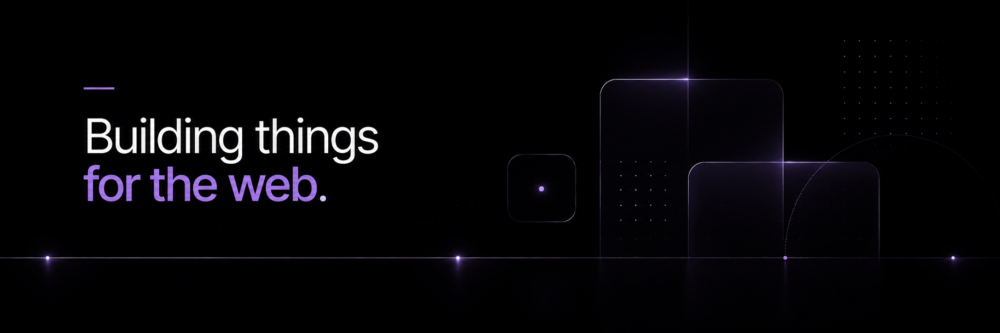

  

 

  
  &nbsp;
  
  &nbsp;
  

 

<h1 align="center">Hey, I'm Francisco Espindola </h1>

<h3 align="center">
  Full Stack Engineer — I turn ideas into products people actually use.
</h3>

 

  <i>"If an idea pops into my head, chances are I'll build it and ship it."</i>
  

 

---

## Who I Am

I'm a **Full Stack Engineer** who ships — from pixel-perfect frontends to rock-solid backends. I care deeply about **UX/UI**, **performance**, and writing code that's clean enough to be proud of. Whether it's a fast MVP or a production-grade platform, I bring ideas to life end-to-end.

-  Obsessed with **pixel-perfect details** and the balance between **aesthetics & function**
-  Currently building with **Next.js, Tailwind CSS & Supabase**
-  Reach me at: **[franchuespindola25@gmail.com](mailto:franchuespindola25@gmail.com)**
-  Code better with [this playlist](https://music.youtube.com/playlist?list=PLr8nCm0aobtRA0SAeeK4Fa9tbWf-r-ton)
-  Off the screen: **anime, gaming & manga**

---

## What I Bring to the Table

| | |
|---|---|
| **Full Stack Development** | End-to-end product delivery — from DB schema to deployed UI |
| **Frontend Excellence** | React, Next.js, Vue, Nuxt — responsive, fast, beautiful |
| **Backend Engineering** | REST APIs, real-time systems, auth, database design |
| **Design-aware** | Figma, Photoshop — I can read and implement design systems |
| **Ship Mentality** | I don't just code, I deliver working products |

---

## Tech Stack

<b>🍣 View Full Tech Stack</b>

#### Core Languages

#### Frontend Frameworks

#### Backend Frameworks

#### Full Stack & Meta-frameworks

#### Styling & Design

#### Databases

#### Tools & DevOps

---

## GitHub Stats

  
  &nbsp;
  

---

  

 

  Made with 🤍🐕 by <a href="https://github.com/esspindola"><strong>Esspindola</strong></a>

